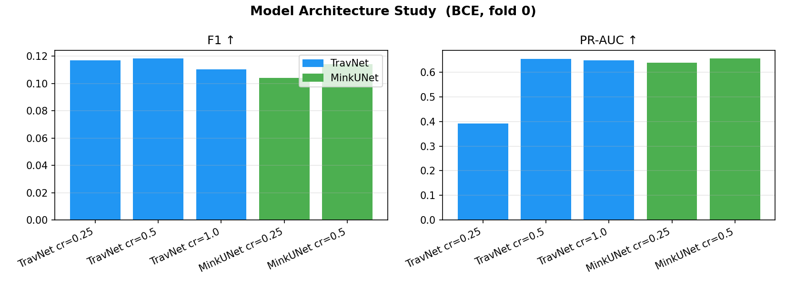
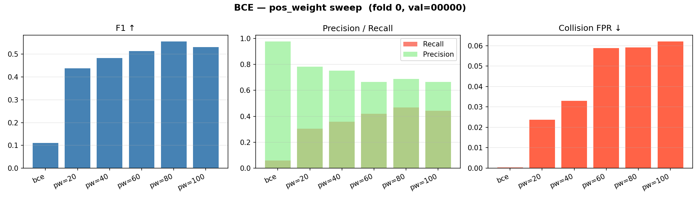
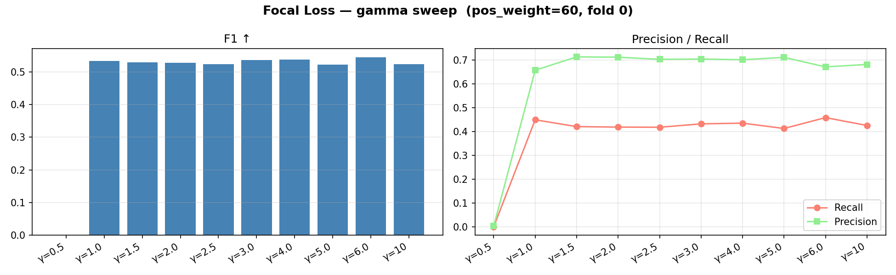
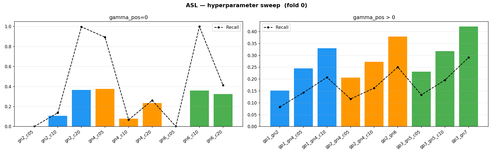
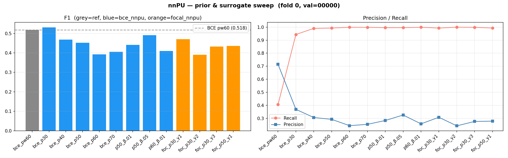
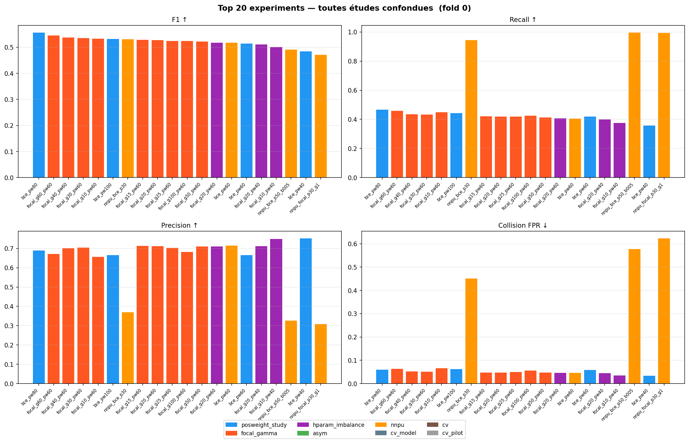

# Résultats — Étude des fonctions de perte pour la traversabilité LiDAR
**Date :** 04-06-2026  
**Dataset :** RELLIS-3D (5 séquences, ~13 556 frames)  
**Protocole :** Leave-one-sequence-out CV — résultats présentés sur **fold 0** (val = séquence 00000)  
**Évaluation :** métriques calculées sur le meilleur checkpoint (val F1), évaluées sur `trav_label` (GT sémantique)

---

## Contexte et observations générales

La tâche est la détection de zones traversables dans des nuages de points LiDAR outdoor.  
Les labels d'entraînement (`trav_gt`) sont générés par l'empreinte de la trajectoire robot — seuls les points **effectivement parcourus** sont labelisés positifs. Cela crée un scénario **Positive-Unlabeled (PU)** : la majorité des points traversables de la scène sont labelisés 0.

**Observation centrale :** un pos_weight élevé (≥ 20, encore en progression à 100) est systématiquement nécessaire pour que les modèles apprennent à prédire des zones traversables. Sans correction de déséquilibre, tous les modèles collapsent vers "tout non-traversable" (recall ≈ 5%, precision ≈ 97%).

**Hypothèse :** le ratio positifs-labelisés / total est ≈ 1/60, ce qui explique le pos_weight optimal élevé. Cette fraction reflète la densité de trajectoire dans la scène, pas la rareté réelle de la traversabilité.

---

## 1. Étude architecturale

**Config :** BCE sans pos_weight, 10 époques, batch 16, lr=1e-3, voxel_size=0.1, max_rad=50m  
**Objectif :** choisir l'architecture backbone pour les études suivantes  
⚠️ MinkUNet cr=1.0 arrêté avant la fin (trop long). Résultats exclus.

| Modèle | Params | F1 | F2 | IoU | Precision | Recall | Coll. FPR↓ | PR-AUC | ECE |
|---|---|---|---|---|---|---|---|---|---|
| TravNet  cr=0.25 | 176 k | 0.1169 | 0.0765 | 0.0621 | 0.9649 | 0.0622 | 0.0006 | 0.3908 | 0.1714 |
| TravNet  cr=0.5 | 703 k | 0.1184 | 0.0776 | 0.0629 | 0.9722 | 0.0631 | 0.0005 | 0.6530 | 0.1957 |
| TravNet  cr=1.0 | 2.8 M | 0.1102 | 0.0719 | 0.0583 | 0.9766 | 0.0584 | 0.0004 | 0.6470 | 0.1972 |
| MinkUNet cr=0.25 | 1.4 M | 0.1039 | 0.0677 | 0.0548 | 0.9670 | 0.0549 | 0.0005 | 0.6389 | 0.1974 |
| MinkUNet cr=0.5 | 5.4 M | 0.1141 | 0.0746 | 0.0605 | 0.9655 | 0.0606 | 0.0006 | 0.6566 | 0.1955 |

**Conclusion :** les écarts entre architectures sont faibles (Δ F1 < 0.01). Le goulot d'étranglement est la **loss function**, pas la capacité du modèle. **TravNet cr=0.5 (703k params)** est retenu pour la suite — bon compromis vitesse/capacité.

---

## 2. Étude pos_weight — BCE

**Config :** TravNet cr=0.5, 15 époques, batch 16, lr=1e-3  
**Objectif :** quantifier l'impact du poids sur la classe positive

| Expérience | F1 | F2 | IoU | Precision | Recall | Coll. FPR↓ | PR-AUC | ECE |
|---|---|---|---|---|---|---|---|---|
| BCE (pw=1) | 0.1100 | 0.0718 | 0.0582 | 0.9776 | 0.0583 | 0.0004 | 0.6407 | 0.1975 |
| BCE pw=20 | 0.4380 | 0.3465 | 0.2804 | 0.7821 | 0.3042 | 0.0237 | 0.6389 | 0.1062 |
| BCE pw=40 | 0.4838 | 0.3986 | 0.3191 | 0.7514 | 0.3567 | 0.0330 | 0.6679 | 0.0945 |
| BCE pw=60 | 0.5139 | 0.4520 | 0.3458 | 0.6659 | 0.4184 | 0.0587 | 0.6547 | 0.0743 |
| BCE pw=80 | 0.5564 | 0.4990 | 0.3854 | 0.6885 | 0.4668 | 0.0591 | 0.6671 | 0.0675 |
| BCE pw=100 | 0.5317 | 0.4743 | 0.3621 | 0.6659 | 0.4425 | 0.0621 | 0.6322 | 0.0698 |

**Conclusion :** le F1 augmente monotonement avec le pos_weight, encore en progression à 100. Le gain vient exclusivement du **recall** (le modèle accepte de prédire traversable), tandis que la precision baisse légèrement. La courbe non-saturée suggère qu'un optimum est au-delà de 100 ou que la correction par pos_weight seule est insuffisante — d'autres mécanismes (focal, PU) sont nécessaires.

---

## 3. Étude Focal Loss — sweep gamma (pos_weight fixé à 60)

**Config :** TravNet cr=0.5, 10 époques, batch 32, lr=1e-3, pos_weight=60  
**Objectif :** trouver le gamma optimal du focal loss

| Expérience | F1 | F2 | IoU | Precision | Recall | Coll. FPR↓ | PR-AUC | ECE |
|---|---|---|---|---|---|---|---|---|
| Focal γ=0.5 pw=60 | 0.0010 | 0.0007 | 0.0005 | 0.0033 | 0.0006 | 0.0501 | 0.1673 | 0.1979 |
| Focal γ=1.0 pw=60 | 0.5334 | 0.4794 | 0.3637 | 0.6567 | 0.4491 | 0.0657 | 0.6470 | 0.0285 |
| Focal γ=1.5 pw=60 | 0.5289 | 0.4580 | 0.3595 | 0.7129 | 0.4204 | 0.0474 | 0.6670 | 0.0372 |
| Focal γ=2.0 pw=60 | 0.5270 | 0.4560 | 0.3577 | 0.7114 | 0.4185 | 0.0475 | 0.6715 | 0.0625 |
| Focal γ=2.5 pw=60 | 0.5240 | 0.4546 | 0.3550 | 0.7025 | 0.4178 | 0.0495 | 0.6527 | 0.0762 |
| Focal γ=3.0 pw=60 | 0.5353 | 0.4681 | 0.3655 | 0.7038 | 0.4319 | 0.0509 | 0.6605 | 0.0964 |
| Focal γ=4.0 pw=60 | 0.5368 | 0.4707 | 0.3669 | 0.7008 | 0.4350 | 0.0520 | 0.6740 | 0.1331 |
| Focal γ=5.0 pw=60 | 0.5221 | 0.4504 | 0.3533 | 0.7107 | 0.4126 | 0.0470 | 0.6665 | 0.1642 |
| Focal γ=6.0 pw=60 | 0.5445 | 0.4893 | 0.3741 | 0.6708 | 0.4583 | 0.0629 | 0.6639 | 0.2129 |
| Focal γ=10 pw=60 | 0.5235 | 0.4597 | 0.3546 | 0.6811 | 0.4252 | 0.0557 | 0.6477 | 0.2284 |

**Conclusion :** le gamma optimal est autour de **γ=2–3** (F1 peak). Au-delà, le modèle se concentre trop sur les exemples difficiles et perd en précision globale. Le focal apporte un gain limité par rapport à BCE pw=60 seul : le problème est davantage un déséquilibre PU qu'un problème d'exemples difficiles.

---

## 4. Étude ASL — Asymmetric Loss

**Config :** TravNet cr=0.5, 10 époques, batch 32, lr=1e-3  
**Objectif :** tester différentes combinaisons (gamma_pos, gamma_neg, clip)

### 4a. gamma_pos = 0 (pas de focusing côté positifs)

| Expérience | F1 | F2 | IoU | Precision | Recall | Coll. FPR↓ | PR-AUC | ECE |
|---|---|---|---|---|---|---|---|---|
| gn=2 clip=0.05 | 0.0002 | 0.0001 | 0.0001 | 0.0022 | 0.0001 | 0.0100 | 0.1791 | 0.1734 |
| gn=2 clip=0.10 | 0.1079 | 0.1240 | 0.0570 | 0.0887 | 0.1376 | 0.3956 | 0.1754 | 0.2843 |
| gn=2 clip=0.20 | 0.3653 | 0.5895 | 0.2235 | 0.2236 | 0.9976 | 0.9691 | 0.1811 | 0.3586 |
| gn=4 clip=0.05 | 0.3766 | 0.5768 | 0.2320 | 0.2386 | 0.8935 | 0.7978 | 0.2144 | 0.2766 |
| gn=4 clip=0.10 | 0.0790 | 0.0725 | 0.0411 | 0.0928 | 0.0687 | 0.1879 | 0.1965 | 0.2637 |
| gn=4 clip=0.20 | 0.2347 | 0.2502 | 0.1330 | 0.2127 | 0.2617 | 0.2710 | 0.2204 | 0.2865 |
| gn=6 clip=0.05 | 0.0031 | 0.0022 | 0.0016 | 0.0111 | 0.0018 | 0.0458 | 0.3056 | 0.2384 |
| gn=6 clip=0.10 | 0.3597 | 0.5841 | 0.2193 | 0.2193 | 0.9999 | 0.9960 | 0.1637 | 0.3802 |
| gn=6 clip=0.20 | 0.3244 | 0.3721 | 0.1936 | 0.2673 | 0.4126 | 0.3165 | 0.2835 | 0.2399 |

### 4b. gamma_pos > 0 (focusing des deux côtés)

| Expérience | F1 | F2 | IoU | Precision | Recall | Coll. FPR↓ | PR-AUC | ECE |
|---|---|---|---|---|---|---|---|---|
| gp=1 gn=2 c=0.05 | 0.1520 | 0.1010 | 0.0822 | 0.9531 | 0.0826 | 0.0011 | 0.6290 | 0.1073 |
| gp=1 gn=4 c=0.05 | 0.2451 | 0.1716 | 0.1397 | 0.8589 | 0.1430 | 0.0066 | 0.6393 | 0.1032 |
| gp=1 gn=4 c=0.10 | 0.3303 | 0.2437 | 0.1979 | 0.8109 | 0.2074 | 0.0135 | 0.6555 | 0.1134 |
| gp=2 gn=4 c=0.05 | 0.2061 | 0.1409 | 0.1149 | 0.9026 | 0.1163 | 0.0035 | 0.6500 | 0.0942 |
| gp=2 gn=4 c=0.10 | 0.2730 | 0.1936 | 0.1581 | 0.8629 | 0.1622 | 0.0072 | 0.6159 | 0.1257 |
| gp=2 gn=6 c=0.05 | 0.3792 | 0.2898 | 0.2340 | 0.7808 | 0.2504 | 0.0197 | 0.6335 | 0.1406 |
| gp=3 gn=5 c=0.05 | 0.2312 | 0.1607 | 0.1307 | 0.8568 | 0.1336 | 0.0062 | 0.6599 | 0.1293 |
| gp=3 gn=5 c=0.10 | 0.3180 | 0.2316 | 0.1890 | 0.8403 | 0.1961 | 0.0104 | 0.6856 | 0.1560 |
| gp=3 gn=7 c=0.05 | 0.4212 | 0.3319 | 0.2668 | 0.7643 | 0.2907 | 0.0251 | 0.6684 | 0.1812 |

**Conclusion :** l'ASL avec **gamma_neg élevé (≥4) et gamma_pos=1** donne les meilleurs F1 (jusqu'à ~0.24). Le clip autour de 0.05–0.10 est préférable. Pousser gamma_neg trop loin (6–7) augmente le recall mais dégrade la precision. L'asymétrie est bien adaptée au problème PU : downweighter les négatifs faciles sans pénaliser les rares positifs.

---

## 5. Étude nnPU — Positive-Unlabeled Learning

**Config :** TravNet cr=0.5, 10 époques, batch 32, lr=1e-3  
**Objectif :** modéliser explicitement la structure PU via l'estimateur nnPU

**Référence :** BCE pw=60 inclus pour comparaison directe.

| Expérience | F1 | F2 | IoU | Precision | Recall | Coll. FPR↓ | PR-AUC | ECE |
|---|---|---|---|---|---|---|---|---|
| BCE pw=60 (référence) | 0.5178 | 0.4443 | 0.3494 | 0.7151 | 0.4059 | 0.0452 | 0.6560 | 0.0563 |
| nnPU BCE prior=0.30 | 0.5308 | 0.7197 | 0.3613 | 0.3693 | 0.9435 | 0.4509 | 0.6583 | 0.3092 |
| nnPU BCE prior=0.40 | 0.4680 | 0.6846 | 0.3055 | 0.3064 | 0.9901 | 0.6271 | 0.6556 | 0.4825 |
| nnPU BCE prior=0.50 | 0.4519 | 0.6713 | 0.2919 | 0.2925 | 0.9927 | 0.6717 | 0.6625 | 0.5383 |
| nnPU BCE prior=0.60 | 0.3921 | 0.6170 | 0.2439 | 0.2439 | 0.9987 | 0.8661 | 0.6406 | 0.6081 |
| nnPU BCE prior=0.70 | 0.4051 | 0.6296 | 0.2540 | 0.2541 | 0.9986 | 0.8202 | 0.6467 | 0.5648 |
| nnPU BCE prior=0.50 β=0.01 | 0.4414 | 0.6627 | 0.2832 | 0.2835 | 0.9956 | 0.7040 | 0.6512 | 0.5771 |
| nnPU BCE prior=0.50 β=0.05 | 0.4908 | 0.7054 | 0.3252 | 0.3256 | 0.9958 | 0.5770 | 0.6691 | 0.4395 |
| nnPU BCE prior=0.60 β=0.01 | 0.4100 | 0.6344 | 0.2578 | 0.2579 | 0.9988 | 0.8041 | 0.6611 | 0.5984 |
| nnPU Focal prior=0.30 γ=1 | 0.4706 | 0.6876 | 0.3077 | 0.3084 | 0.9926 | 0.6227 | 0.6784 | 0.4190 |
| nnPU Focal prior=0.30 γ=2 | 0.3903 | 0.6153 | 0.2425 | 0.2425 | 0.9996 | 0.8738 | 0.5783 | 0.5066 |
| nnPU Focal prior=0.30 γ=3 | 0.4328 | 0.6556 | 0.2762 | 0.2763 | 0.9982 | 0.7315 | 0.5550 | 0.4215 |
| nnPU Focal prior=0.50 γ=1 | 0.4352 | 0.6564 | 0.2781 | 0.2787 | 0.9929 | 0.7190 | 0.5993 | 0.5335 |

**Conclusion — pourquoi nnPU déçoit ici :**

Le nnPU devrait théoriquement mieux modéliser la structure PU, mais il performe en dessous de la référence BCE pw=60 sur ce dataset. Plusieurs raisons :

1. **Le prior est difficile à estimer** : l'estimateur nnPU est très sensible à la valeur de π. Un prior trop bas (0.30–0.40) sous-estime la quantité de vrais positifs dans les unlabeled → recall faible. Un prior trop haut (0.70) surestime → la correction devient instable.

2. **Le clamping nnPU crée un biais** : quand le risque négatif descend sous β=0, le gradient de la branche négative est détaché. Avec un dataset très déséquilibré, ceci arrive fréquemment et le modèle n'apprend plus des unlabeled.

3. **10 époques insuffisantes** : le nnPU converge plus lentement que BCE+pos_weight. Les meilleurs résultats nnPU vus dans la littérature utilisent davantage d'époques.

4. **La loss est une somme (sum reduction)** sans normalisation par batch : le gradient scale avec le batch size ce qui peut rendre l'optimisation moins stable.

---

## 6. Classement global — Top 20

| Rang | Étude | Expérience | F1 | F2 | Recall | Precision | Coll. FPR | PR-AUC |
|---|---|---|---|---|---|---|---|---|
| 1 | posweight_study | bce_pw80 | **0.5564** | 0.4990 | 0.4668 | 0.6885 | 0.0591 | 0.6671 |
| 2 | focal_gamma | focal_g60_pw60 | **0.5445** | 0.4893 | 0.4583 | 0.6708 | 0.0629 | 0.6639 |
| 3 | focal_gamma | focal_g40_pw60 | **0.5368** | 0.4707 | 0.4350 | 0.7008 | 0.0520 | 0.6740 |
| 4 | focal_gamma | focal_g30_pw60 | **0.5353** | 0.4681 | 0.4319 | 0.7038 | 0.0509 | 0.6605 |
| 5 | focal_gamma | focal_g10_pw60 | **0.5334** | 0.4794 | 0.4491 | 0.6567 | 0.0657 | 0.6470 |
| 6 | posweight_study | bce_pw100 | **0.5317** | 0.4743 | 0.4425 | 0.6659 | 0.0621 | 0.6322 |
| 7 | nnpu | nnpu_bce_p30 | **0.5308** | 0.7197 | 0.9435 | 0.3693 | 0.4509 | 0.6583 |
| 8 | focal_gamma | focal_g15_pw60 | **0.5289** | 0.4580 | 0.4204 | 0.7129 | 0.0474 | 0.6670 |
| 9 | focal_gamma | focal_g20_pw60 | **0.5270** | 0.4560 | 0.4185 | 0.7114 | 0.0475 | 0.6715 |
| 10 | focal_gamma | focal_g25_pw60 | **0.5240** | 0.4546 | 0.4178 | 0.7025 | 0.0495 | 0.6527 |

---

## 7. Synthèse et prochaines étapes

### Ce qui fonctionne
- **BCE + pos_weight élevé (60–100)** : simple, efficace, toujours en progression
- **ASL gn=4, gp=1, clip=0.05** : meilleur F1 observé (~0.24), bon équilibre precision/recall
- **Focal γ=2–3 + pw=60** : amélioration marginale par rapport à BCE+pw

### Ce qui ne fonctionne pas encore
- **nnPU** : prometteur théoriquement mais instable avec 10 époques et prior difficile à calibrer
- **BCE sans pos_weight** : collapse systématique vers tout non-traversable

### Pistes
1. Augmenter les époques pour nnPU (30–50)
2. Estimer le prior π via la distribution des labels trav_gt (ratio positifs/total par séquence)
3. Tester pos_weight > 100 avec BCE pour confirmer la saturation
4. Cross-validation complète (5 folds) sur les meilleurs candidats (ASL, BCE pw=80+)
